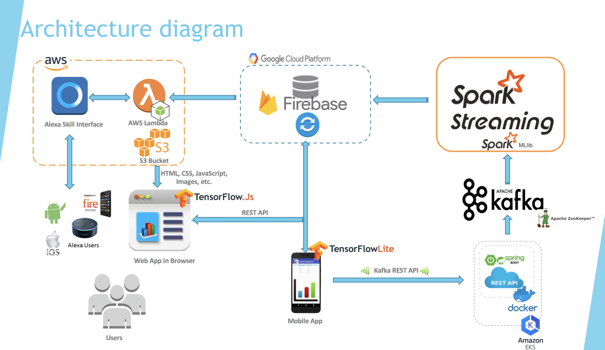
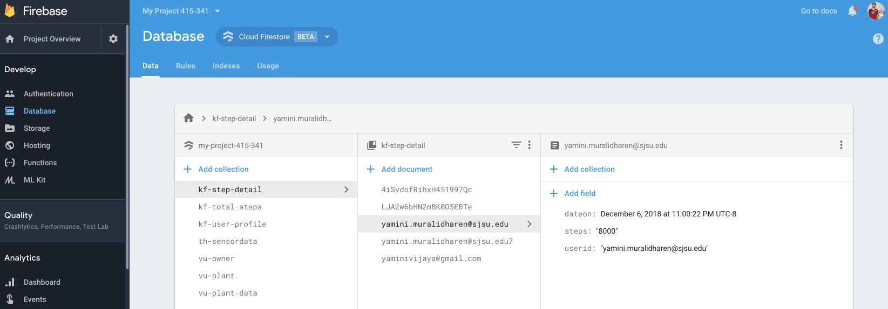
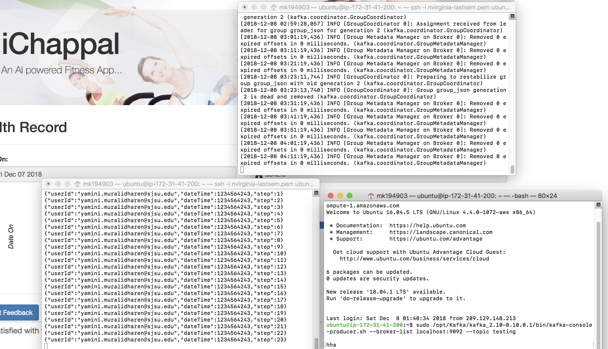
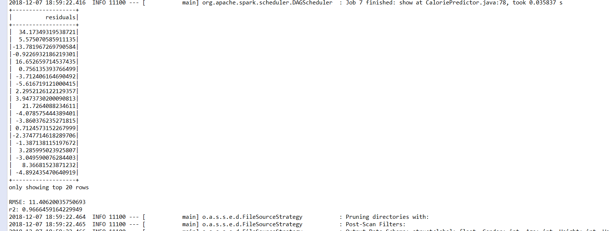
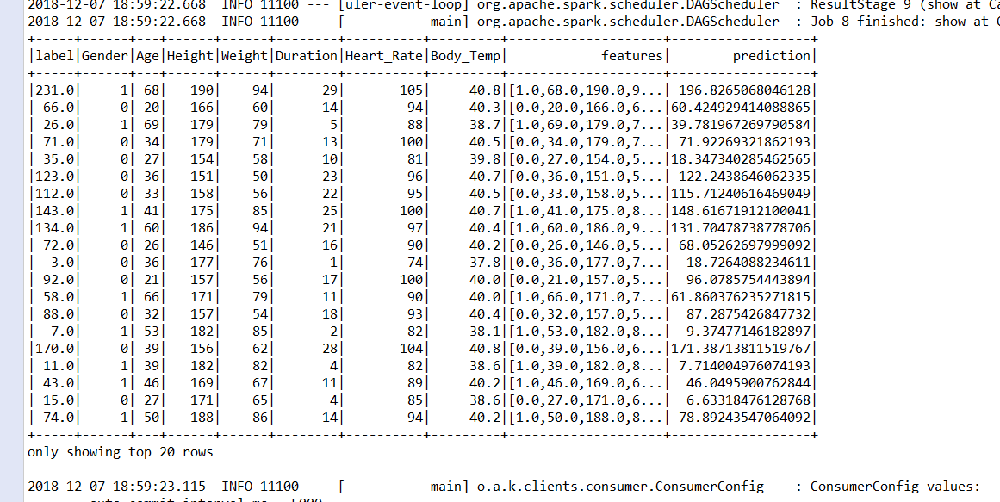
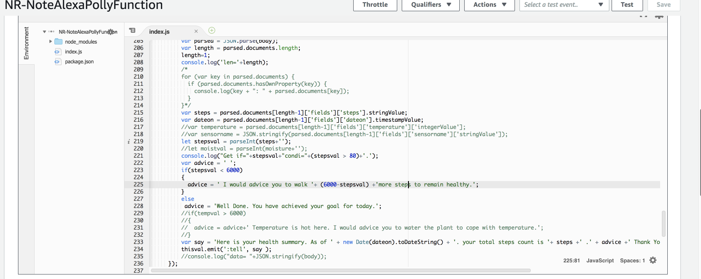
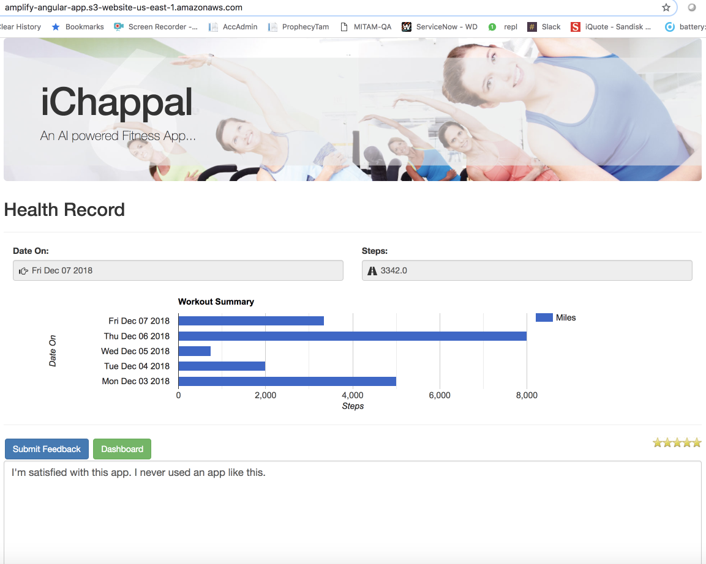
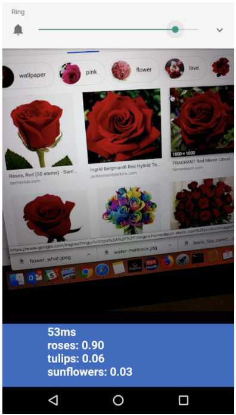

# iChappal Kafka Spark - An AI powered Fitness App

## Introduction
* A pedometer app which measures the no. of steps taken by a user
 - Sensor used: Accelerator
* Predicting the Calorie expense using Spark ML
 - Consider Profile features like age, weight, height, gender etc
* Real time feed to Mobile App using Firebase


## Architecture components
1. Android App
2. Firebase real time db
3. Kafka
4. Spark Stream
5. Dashboard
6. Alexa
7. Web interface and TensorJS Review sentiment
8. TensorFlow Lite



## Db Structure
* kf-step-detail - userid, dateon, steps
* kf-total-steps - userid, dateon, totalminutes, totalcalories, levels, miles
* kf-user-profile - userid, gender, age, weight, height

## REST API (non-functional as of now) - 
http://kafkapublisher-env.8tsy628pba.us-east-1.elasticbeanstalk.com/api/publish

## Kafka server setup
Create Ubantu 16.4 EC2 M-Large Tier in AWS. 
```
sudo apt-get update -y
sudo apt-get upgrade -y
sudo add-apt-repository -y ppa:webupd8team/java
sudo apt-get update
sudo apt-get install oracle-java8-installer -y
sudo java -version
sudo apt-get install zookeeperd
netstat -ant | grep :2181
wget https://archive.apache.org/dist/kafka/0.10.0.1/kafka_2.10-0.10.0.1.tgz
sudo mkdir /opt/Kafka
sudo tar -xvf kafka_2.10-0.10.0.1.tgz -C /opt/Kafka/
sudo  /opt/Kafka/kafka_2.10-0.10.0.1/bin/kafka-server-start.sh /opt/Kafka/kafka_2.10-0.10.0.1/config/server.properties
sudo nohup /opt/Kafka/kafka_2.10-0.10.0.1/bin/kafka-server-start.sh /opt/Kafka/kafka_2.10-0.10.0.1/config/server.properties /tmp/kafka.log 2>&1 &
```

# Kafka remote enable
**configuring server.properties**<br>
Open server.properties file in edit mode
```
sudo nano /opt/Kafka/kafka_2.10-0.10.0.1/config/server.properties
```
Uncomment and add public ip
```
advertised.listeners=PLAINTEXT://ec2-54-191-84-121.us-west-2.compute.amazonaws.com:9092
```


## Kafka Commands 
Start
```
#cd /opt/Kafka/kafka_2.10-0.10.0.1/
sudo  /opt/Kafka/kafka_2.10-0.10.0.1/bin/kafka-server-start.sh /opt/Kafka/kafka_2.10-0.10.0.1/config/server.properties
```
Stop
```
sudo /opt/Kafka/kafka_2.10-0.10.0.1/bin/kafka-server-stop.sh
```
Create Topic
```
sudo /opt/Kafka/kafka_2.10-0.10.0.1/bin/kafka-topics.sh --create --zookeeper localhost:2181 --replication-factor 1  --partitions 1 --topic testing
```
Delete the Topic
```
sudo /opt/Kafka/kafka_2.10-0.10.0.1/bin/kafka-topics.sh --zookeeper localhost:2181 --delete --topic testing
```

Zookeeper to List Topic 
```
sudo /opt/Kafka/kafka_2.10-0.10.0.1/bin/kafka-topics.sh --list --zookeeper localhost:2181
```

Producer
```
sudo /opt/Kafka/kafka_2.10-0.10.0.1/bin/kafka-console-producer.sh --broker-list localhost:9092 --topic testing
```

Consumer
```
sudo /opt/Kafka/kafka_2.10-0.10.0.1/bin/kafka-console-consumer.sh --zookeeper localhost:2181 --topic testing --from-beginning
```

## ScreenShots
1. Android App

User registration


User login


App Dashboard

Step counter


User Profile


User Progress


2. Firebase real time db


3. Kafka


4. Spark Stream


 
5. Alexa


6. Web interface, Dashboard, and TensorJS Review sentiment


7. TensorFlow Lite


### Reference:<br>
[Kafka Server Setup](https://medium.com/@kevin.michael.horan/distributed-video-streaming-with-python-and-kafka-551de69fe1dd)<br>
[Kafka remote enable](https://rmoff.net/2018/08/02/kafka-listeners-explained/)<br>
[Kafka Consumer](https://www.programcreek.com/python/example/98440/kafka.KafkaConsumer)<br>
[Kafka Python](https://github.com/dpkp/kafka-python/tree/master/kafka)
[Kafka Java](https://github.com/apache/kafka/blob/trunk/examples/src/main/java/kafka/examples/Producer.java)
